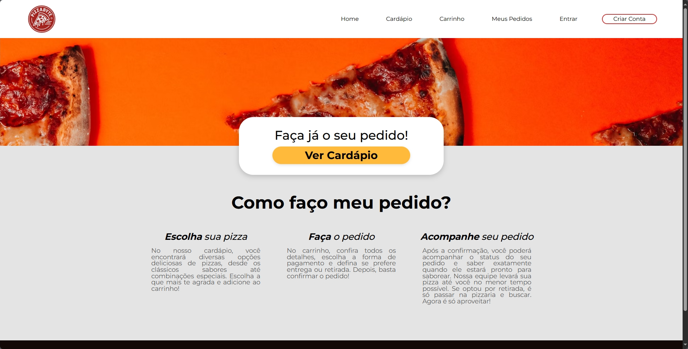
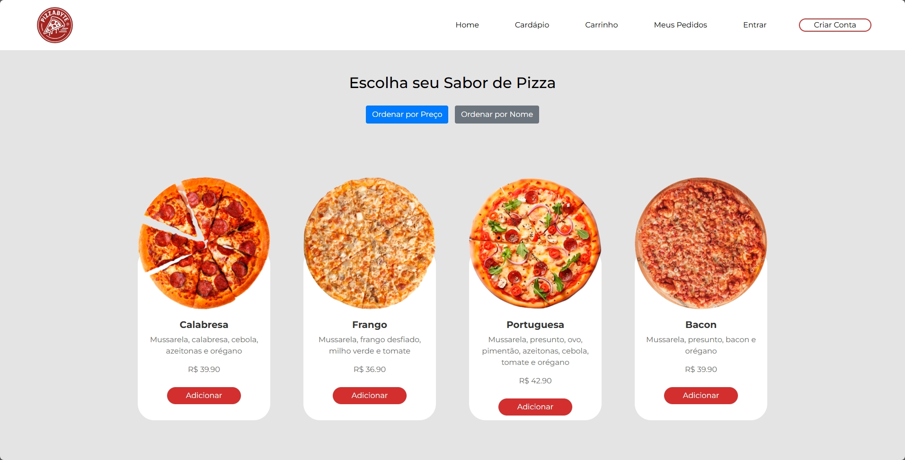
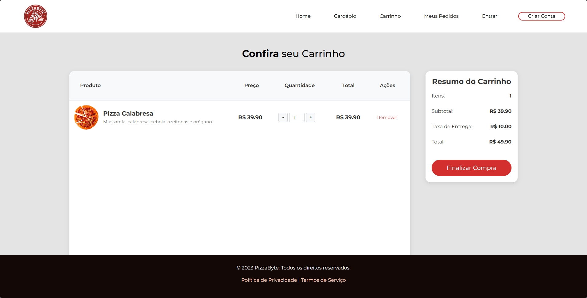
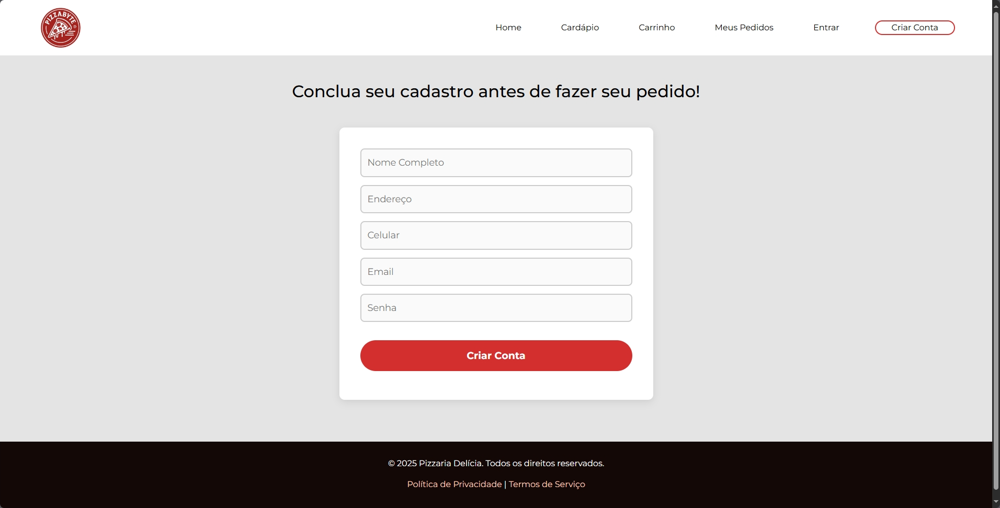
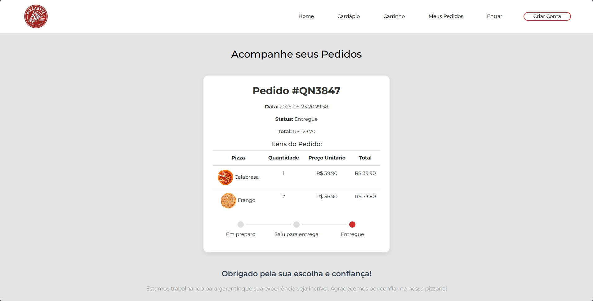
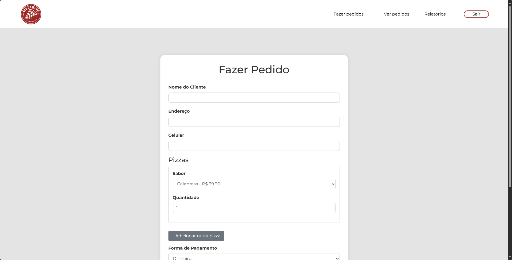
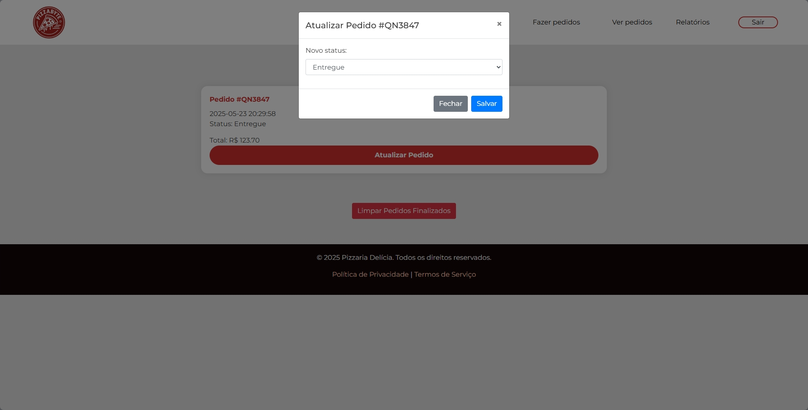
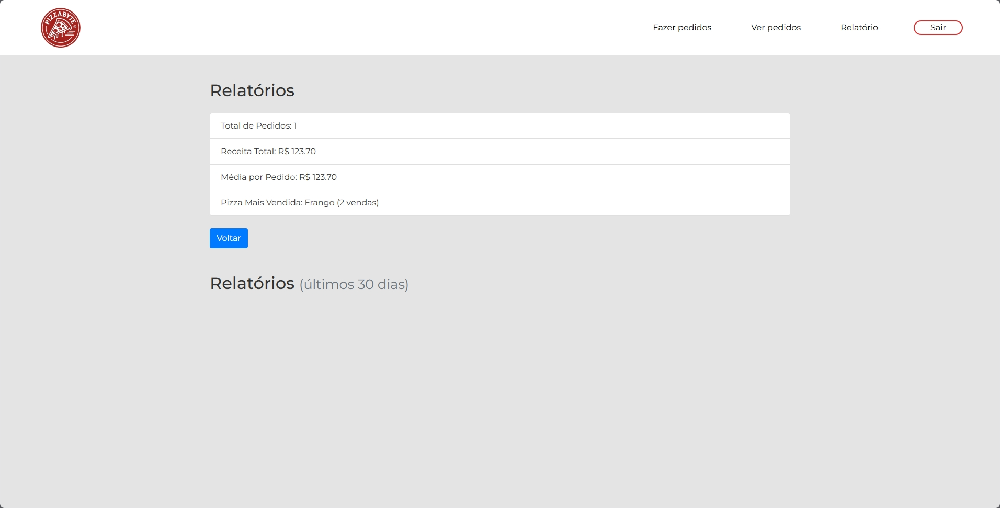

# 🍕 PizzaByte — Sistema de Gerenciamento de Pizzaria

Aplicação web desenvolvida como projeto acadêmico para as disciplinas de **Banco de Dados** e **Estrutura de Dados** da Universidade do Distrito Federal (UDF). O sistema simula o funcionamento completo de uma pizzaria, integrando desenvolvimento web com Flask, banco de dados SQLite e conceitos aplicados de estruturas de dados e algoritmos.

---

## 🖼️ Interface

| | | |
|:---:|:---:|:---:|
|  |  |  |
| Homepage | Cardápio | Carrinho |
|  |  |  |
| Cadastro | Pedidos | Pedido Manual (Admin) |
|  |  | |
| Gestão de Pedidos (Admin) | Relatórios | |
 
---

## 🛠️ Tecnologias

- **Python 3** + **Flask**
- **SQLite** via `database.py`
- **HTML5 / CSS3** + **Bootstrap**
- **Jinja2** para templates

---

## ⚙️ Funcionalidades

**Área do Cliente**
- Visualização do cardápio com imagens, descrições e preços
- Ordenação por preço (Bubble Sort) ou nome (Insertion Sort)
- Carrinho com ajuste de quantidade, cálculo de subtotal e taxa de entrega
- Acompanhamento de pedidos com timeline de status

**Área Administrativa**
- Registro manual de pedidos com seleção de pizzas, cliente e forma de pagamento
- Gestão de status dos pedidos (em preparo → saiu para entrega → entregue / cancelado)
- Relatórios com total de pedidos, receita acumulada, média por pedido e pizza mais vendida

**Lógica e Estruturas de Dados**
- **Fila** (`deque`) para gerenciar pedidos em ordem de chegada
- **Pilha** (`list`) para pedidos cancelados com opção de restaurar
- **Função recursiva** `soma_total_recursiva` para calcular o total do carrinho

---

## 📁 Estrutura do Projeto

```
sistemaPizzaria/
├── app.py              # Aplicação Flask principal
├── database.py         # Criação e configuração do banco de dados
├── pizzabyte.db        # Banco de dados SQLite (gerado automaticamente)
├── static/
│   ├── css/            # Bootstrap e estilos customizados
│   └── img/            # Imagens de pizzas e logos
├── templates/          # Páginas HTML com Jinja2
│   ├── home.html
│   ├── cardapio.html
│   ├── carrinho.html
│   ├── cadastro.html
│   ├── login.html
│   ├── pedido.html
│   ├── pedidomanual.html
│   ├── verpedido.html
│   ├── relatorios.html
│   └── relatorio.html
└── design/             # Capturas de tela da interface
```

---

## 🚀 Como Executar

### 1. Clone o repositório

```bash
gh repo clone pedrinhozx865/Projeto-PizzaByte
cd sistemaPizzaria
```

### 2. Crie e ative o ambiente virtual

**Windows:**
```bash
python -m venv venv
venv\Scripts\activate
```

**Linux/macOS:**
```bash
python3 -m venv venv
source venv/bin/activate
```

### 3. Instale as dependências

```bash
pip install flask
```

### 4. Configure o banco de dados

```bash
python database.py
```

### 5. Inicie a aplicação

```bash
python app.py
```

Acesse em: [http://localhost:5000](http://localhost:5000)

---

## 🗄️ Banco de Dados

O banco `pizzabyte.db` é criado automaticamente na primeira execução com as seguintes tabelas:

| Tabela | Campos principais |
|---|---|
| `pizzas` | id, nome, descrição, preço, imagem |
| `carrinho` | id, pizza_id, quantidade |
| `pedidos` | id, número, status, data, total |

Quatro pizzas de exemplo são inseridas automaticamente (Calabresa, Frango, Portuguesa, Bacon).

---

## 👥 Autores

Desenvolvido por alunos do curso de Ciência da Computação — UDF.

---

> Projeto acadêmico de código aberto. Sinta-se à vontade para estudar, usar e expandir.
